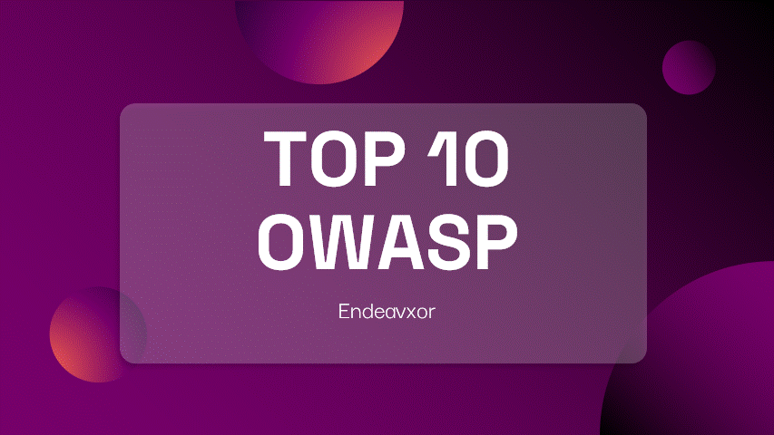

# Presentation-OWASP-TOP-10



In order to raise awareness about the vulnerabilities included by developers in their projects *(for an English oral in class)*, I realized an environment voluntarily vulnerable to the most common/dangerous attacks referenced by the TOP 10 of OWASP for demonstrative purposes.

> ⚠️ **CAUTION** : Containers to demonstrate vulnerabilities are intentionally exploitable, so be careful where you create them


---


## Prerequisites :

- docker-compose

---
## Create environment : 

```bash
git clone https://github.com/Endeavxor/Presentation-OWASP-TOP-10.git
cd "Presentation-OWASP-TOP-10"
docker-compose up .
```

## Connecting :

- Go to http://localhost:5000/
- Login : Endeavxor
- Password : password 
- (or you can use SQLi to login :) )

> 📌 **Note** : The CSRF attack demonstration is not deployed in the docker-compose but the site remains vulnerable to this type of attack *( see ./twouitter_web_csrf/ for an example)*

---
